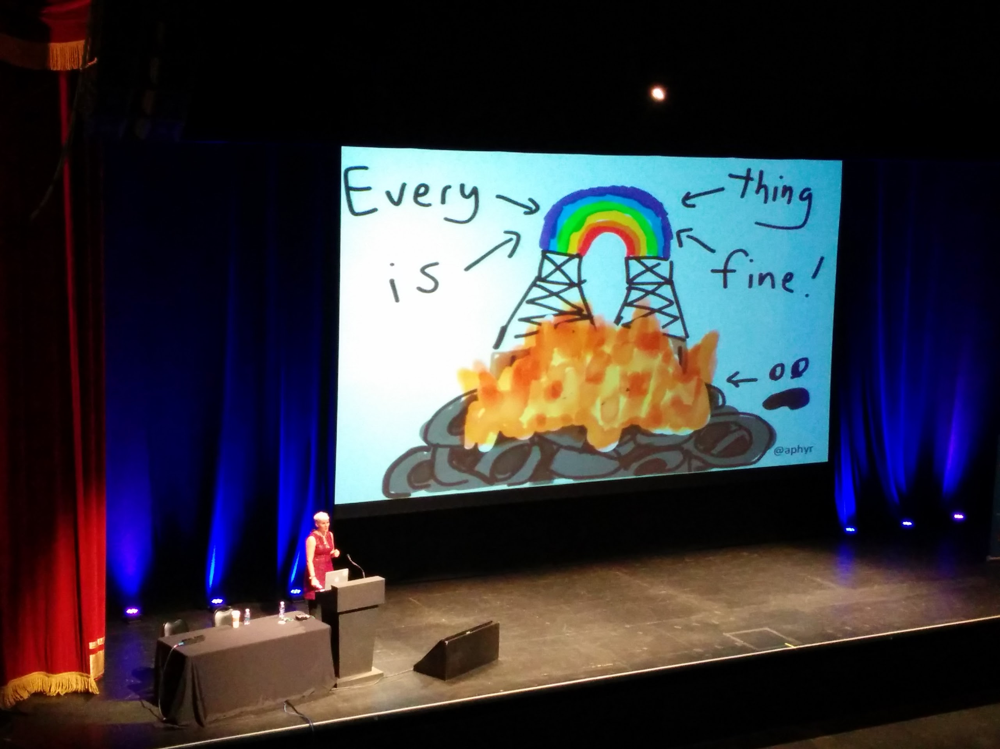

# StrangeLoop 2015

**StrangeLoop er en spennende konferanse for softwareutviklere, som arrangeres årlig i St. Louis, Missouri. Konferansen har vanligvis et bredt spekter av tema, slik som programmeringspråk, alternative databaser, concurrency, distribuerte systemer og sikkerhet, og fokuserer mer på teknologi enn på prosess.**

**Årets konferanse—den syvende i rekka—ble nylig arrangert, og BEKK var naturligvis til stede.**

Det var i år mye fokus på problemstillinger relatert til distribuerte systemer. Kanskje ikke så overaskende, slik som mikrotjenester er i vinden om dagen. Vi kommer tilbake til dette, men vil først nevne et par andre foredrag vi synes var svært gode.

## Teknologi i aktivisme og undertrykkelse

Et av foredragene som sitter sterkest igjen hos oss etter konferansen var keynoten Idalin "Abby" Bobé holdt. Kanskje fordi denne touchet litt mer alvorligere tema enn en vanligvis får servert på slike konferanser. 

Hun fortalte om sin bakgrunn, om oppveksten med minoritetsbakgrunn i fattige strøk i Philadelphia, og arbeidet hun gjør i dag. Bobé er, i tillegg til å være konsulent i ThoughtWorks, en selvutnevnt tech-aktivist. Hun fokuserer på hvordan teknologi kan brukes til å hjelpe folk som trenger det, både direkte og ved å samle oppmerksomhet rundt viktige saker.

Både Bobé og andre i ThoughtWorks har vært i Ferguson i forbindelse med urolighetene der, og hun malte et tydelig bilde av hvordan teknologi har bidratt—både på godt og ondt. Selv om teknologi har spilt en viktig rolle for aktivistene for å få delt det som skjer med resten av verden, og å få fokus på ting myndighetene forsøker å skjule, så har også teknologien blitt brukt imot dem.

Som teknologer har vi mange muligheter, og det er viktig å tenke igjennom hvordan vi bruker dem.

> Video: ["From Protesting to Programming: Becoming a Tech Activist" by Idalin "Abby" Bobé](https://youtu.be/gy82S8tjJX8)  

En annen keynote, av Morgan Marquis-Boire, fortsatte på sett og vis denne tråden. Mannen har lang fartstid innen sikkerhetsfeltet, og har sett mange trussler på nært hold.

Han fortalte om mange av dem som velger å bruke teknologi til ondt, og deres motiver og insentiver. Vi fikk høre om alt fra dedikerte cyberangrepsteam til hacking-verktøy solgt som hyllevare, hvem som bruker slikt, og hva det typisk brukes til.

Det ble presentert en rekke anekdoter fra ting han har opplevd i arbeidet sitt, ispedd en god dose humor underveis.

Foredraget er overhodet ikke teknisk, men er en god tankevekker og en påminnelse om en del ting det er lett å glemme om en ikke jobber med sikkerhet til daglig.

> Video: ["Security for Humans: Privacy and Coercion Resistant Design" by Morgan Marquis-Boire](https://youtu.be/k4ypqzOShZs)

## λ calculus, et universelt programmeringspråk

Et annet foredrag vi absolutt vil anbefale å se, i alle fall om du er interessert i programmeringspråk eller logikk, er Philip Wadler sin presentasjon. Mannen er ikke bare en legende i programmeringspråkmiljøet, men også en karismatisk og morsom foredragsholder.

Det starter med en kort historiefortelling om programmeringens spede begynnelse. Vi ser hvordan [lambda calculus](https://en.wikipedia.org/wiki/Lambda_calculus), [rekurive funksjoner](https://en.wikipedia.org/wiki/Computable_function) og [turingmaskiner](https://en.wikipedia.org/wiki/Turing_machine) alle dukket samtidig. Er matematikk oppdaget eller noe som blir oppfunnet av matematikere? Wadler argumenterer for det førstnevnte, og at det samme dermed gjelder lambda calculus.

> "Most of you use programming languages that are invented. And you can tell, can't you? This is my invitation to you: to use programming languages that are discovered."

Han presenterer videre [Gentzens regler for deduksjon](https://no.wikipedia.org/wiki/Naturlig_deduksjon), og hvordan disse kan sees som et typesystem for lambda calculus. Preposisjoner er her ekvivalente med typer, bevis med programmer, og normalisering (forenkling) av bevis blir det samme som evaluering av programmer. Det er denne sammenhengen som er kjent som [Curry–Howard korrespondansen](https://en.wikipedia.org/wiki/Curry–Howard_correspondence).

> "Every good idea will be discovered twice. Once by a logician, and once by a computer scientist."

Det er mange morsomme poenger underveis, og vi er innom alt fra filmen Independence Day til multiverses. Et fremragende foredrag, såfremt du ikke er redd for slides med litt matematikk på.

> Video: ["Propositions as Types" by Philip Wadler](https://youtu.be/IOiZatlZtGU)

## Distribuerte systemer

Det temaet det helt klart var flest foredrag om på årets StrangeLoop var distribuerte systemer. Her er det flere gode foredrag å velge mellom.

Jon Moore startet fredagen med å presentere sin forskning på hvordan man kan oppnå både kausalitet mellom hendelser og synkroniserte klokker i distribuerte systemer. Løsning hans bygger på teorien om hybride lamport clocks, og heter 'Distributed Monotonic Clocks', hvor han bruker flokkteori (insert eksempel på flokk-algoritme her som eksempel) for å synkronisere klokker i en cluster av maskiner uten at alle maskinene må kommunisere.

> Video: ["How to Have your Causality and Wall Clocks, Too" by Jon Moore](https://youtu.be/YqNGbvFHoKM)

Peter Bailis (insert pun om Game of Thrones her) forteller oss hvordan det å designe systemer for worste case scenario istedet for average case scenario i noen tilfeller kan gi bedre ytelse i avarge case scenario.

> "Your service's corner case may be its consumer's average case."

Design for worst case scenario når:

<!-- Burde oversettes til norsk: -->

* Corner cases are common
* Environmental conditions are variable
* When "normal" isn't as normal as you think

<!-- Quote? Eller bør det skrives om til et poeng på norsk? --> 

Defining "normal" defines our designs.

> Video: ["When "Worst" is Best (in Distributed Systems)" by Peter Bailis](https://youtu.be/ZGIAypUUwoQ)

Det er jo ofte stort fokus på å bygge stateless services som er lett å skalere. Men er servicene våre virkelig stateless? Catie McCaffrey forteller at oss stateless services ofte flytter state ned til databasen. Men i noen tilfeller så kan det lønne seg å designe services som tar vare på state i applikasjonen, noe de for eksempel har gjort i tjenesten Uber.

> Video: ["Building Scalable Stateful Services" by Caitie McCaffrey](https://youtu.be/H0i_bXKwujQ)

Mannen bak Kafka, Jay Kreps, gir en introduksjon til stream processing som ett tredje prosseseringsparadigme i tillegg til de klassiske paradigmene request/response og batch processing.

> Video: ["Apache Kafka and the Next 700 Stream Processing Systems" by Jay Kreps](https://youtu.be/9RMOc0SwRro)

Hvis du er ny til stream processing så anbefaler vi å ta en titt på foredraget. Og hvis du ønsker å lære mer om streams i frontend-koden din så gir Pam Selle en introduksjon til hva streams er og hvordan man kan jobbe med streams i javascript.

> Video: ["Streams: The data structure we need" by Pam Selle](https://youtu.be/3iKkwzlch0o)  

## TL;DR

Distribuerte systemer er vanskelig.

