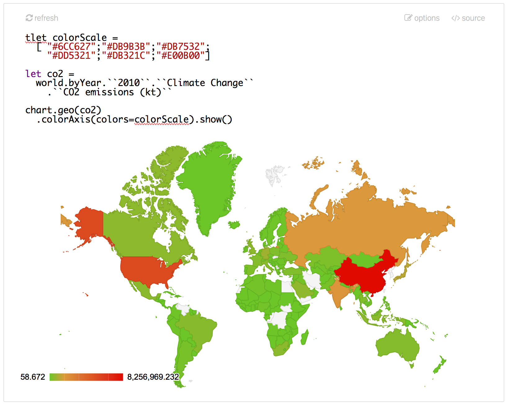

# Programmeringens fremtid

Som programmerere, hvordan kommer hverdagen vår til å se ut noen år frem i tid? Hva vil det egentlig si å programmere i fremtiden? Og hvem kommer programmerere til å være da?

Dette er spørsmålet som sto på agendaen under [Future Programming Workshop](http://www.future-programming.org/), en event som ble arrangert i St Louis i slutten av september, i forkant av [StrangeLoop 2015](https://thestrangeloop.com/).

## De store linjene

Som arrangøren formulerte det innledningsvis: *at StrangeLoop you'll see a lot of stuff that actually works, but what about five or ten years from now?* Vi forsøker vi å løfte blikket for å få et glimt av hva som rører seg på horisonten. Og hvis vi myser litt, så kan dagens temaer kan grovt deles inn i to kategorier:

1. hvordan kan nye måter å programmere hjelpe oss å løse problemer, og
2. hvordan kan vi bringe programmering til nye områder og brukergrupper?

Vi ser altså både på hvordan *programmering blir for programmerere* i fremtiden, og hvordan vi bedre kan tilrettelegge for *programmering for nye grupper mennesker*.

## Programmering for programmerere

Fremtiden til programmerere er i hovedsak knyttet til hvilke verktøy og språk vi har tilgjengelig. Hva skal til for å gjøre det enklere for oss å løse problemer fremover?

### Predictive programming

Vi startet dagen med to karer fra [Probabilistic Computing Project](http://probcomp.csail.mit.edu/) ved MIT, Richard Tibbetts og Vikash K. Mansinghka, som fortalte om sannsynligheter og usikkerhet. For de fleste av oss er dette kanskje noe vi forbinder med statistikkfaget fra universitetet, men knapt et verktøy vi bruker aktivt i hverdagen. Hva skal til for å endre på det, og hva kan det gi oss?

*Probabilistic programming* er feltet som befinner seg i kryssingspunktet mellom statistikk og computer science. Der CS tradisjonelt resonerer og løser problemer med basis i logikk, så er verktøykassa her utvidet med sannsynlighetsmodeller og statistiske metoder.

Hvorfor er dette så viktig? Selv om data er kjærnen i mange av systemene vi lager, så kan de være vanskelig å forstå, og det trekke  logiske slutninger basert på datasett er en stor utfordring.

> "Everybody is excited about big data, but it's hard to understand what data actually means."

Vi startet dagen med å se på et produkt som forsøker å gjøre noe med dette. [BayesDB](http://probcomp.csail.mit.edu/bayesdb/) er en database som lar oss stille spørsmål om sannsynlige implikasjoner av data. Ved hjelp av BQL, et språk med syntaks i familie med SQL, kan vi stille helt nye typer spørsmål sammenliknet med hva dagens databaser gjør oss i stand til.

Vokabularet utvides med keywords som INFER, ESTIMATE og SIMULATE. Disse gjør oss i stand til å estimere data vi mangler basert på modellen for dataene vi allerede har. Vi kan også bruke modellen til kvalitetskontroll på data, eller å utlede hvilke attributter som har gjensidige sammenhenger eller avhengigheter. En annen mulighet er å generere nye data basert på modellen, slik at vi får "dummy-data" som overholder mange av de samme egenskapene som det virkelige datasettet.

Denne *modellen* som gjør oss i stand til alt dette er kjernen i probabilistic programming. Sannsynlighetsmodeller/distributions[?], og særlig det å velge en som passer dataene, kan være vanskelig. Heldigvis slipper vi som brukere av BayesDB å forholde oss til denne direkte. Modellen genereres ved hjelp av forskjellige teknikker fra maskinlæring, og approksimerer dataene så langt den klarer. Vi har selvsagt også muligheten til å utbedre modellen ytterligere ved hjelp av et eget *Meta-Modelling Language* (MML) dersom vi sitter på informasjon om relasjoner i datasettet.

> Video: [BayesDB: Query the Probable Implications of Data - Richard Tibbetts](https://youtu.be/7_m7JCLKmTY)

Etter BayesDB var vi også innom et par andre systemer basert på denne måten å komputere på. Den mest interessante var antagelig [Picture](http://mrkulk.github.io/www_cvpr15/), et språk/system for å utlede 3D-modeller fra bilder.

Picture fungerer slik at en 3D-scene-generator utleder et utkast til verdier for ulike atributter for modellen. Disse sendes til en renderer, som så lager et sample-bilde som sendes til en modul som sammenlikner generert bilde med input. Rinse and repeat 100000 ganger, og systemet har kommet frem til en 3D-modell som *sannsynligvis* matcher bildet ganske godt.

Systemet må på forhånd vite hva slags objekter eller scener bildet kan inneholde slik at generatoren har noe å ta utgangspunkt i. Blant eksemplene som ble demonstrert var modellering av en veibane og av ansikter.

> Video: [An Overview of Probabilistic Programming - Vikash K. Mansinghka](https://youtu.be/-8QMqSWU76Q)

Alle prosjektene som ble presentert hadde en del igjen før de var helt klare, men virket veldig spennende allerde nå. Det blir spennende å se hvor dette ender.

### Live programming

En annen som hadde tanker om hvordan vi bør programmere i fremtiden var Sean McDirmid ved Microsoft Research. Han presenterte et prosjekt der de utforsker hvordan en kan gå fra følgende flyt

- skriv kode, 
- kjør kode, 
- se hva som skjer, 
- prøv igjen

til en mer kontinuerlig prosess, der resultatet av endringer er umiddelbart åpenbare.

Han presenterte en platform/et programmeringspråk som har et begrep om flyt frem og tilbake i tid, og der infererte typer avgjør mulige verdier. Platformen var splittet mellom kode, og resultatet av koden.

En av egenskapene han demonstrerte med språket var *holes*, en slags "tom" verdi som ble tildelt en default eller tilfeldig verdi av systemet, basert på typen. En annen viktig egenskap var *scrubbing*, eller muligheten til å velge mellom gyldige verdier for typen, og samtidig se output endre seg i real time. Mye av programmeringsflyten foregikk ved å klikke og dra linker/sammenhenger mellom verdier og symboler i koden.

-- og alle eksmpelene handlet om å tegne ulike 2D-figurer.

Det hele virket veldig til å være på stadiet der en utforsket ulike idéer. Har litt vanskelig for å se for meg denne typen programmering på den typen problemer vi jobber med til daglig, men har sansen for at det likevel drives research av denne typen.

> Video: [A Live Programming Experience - Sean McDirmid](https://youtu.be/YLrdhFEAiqo)

## Programmering for folk flest

De resterende foredragene handlet i større grad om hvordan vi kan hjelpe andre å utnytte den superkraften det er å kunne fortelle datamaskiner hva de skal gjøre.

### Data Journalism

En trend som allerede er godt i gang er at journalister i stadig økende grad benytter åpne data til å finne informasjon til artikler. Dette fører til to store problemstillinger:

- *Transparency*  -- er konklusjonene missledende?
- *Reproducability* -- er konklusjonene korrekte?

Hvor kommer dataene fra? Er koden brukt til å lage figurer og å trekke konklusjoner open source? Kan leseren endre presentasjonen, slik at en kan belyse ulike aspekter ved dataene?

Foredragsholderen, Tomas Petricek, argumentete for at for å løse disse problemene må denne typen artikler bør sees på som programmer. Som illustrasjon av dette ble verktøyet [The Gamma](http://thegamma.net/) demonstrert. Her blir både journalisten og leserne (i varierende grad) ansett som programmerere.

"Kildekoden" til en artikkel i The Gamma er en kombinasjon av markdown-tekst med kildekode for de uilke plottene/figurene der det trengs. Koden er i F#, og nøkkelen til det hele er støtten for Type Providers. Disse gjøre det enkelt å plugge dataene inn i grafer, der typene tilbyr mulighet til å automatisk generere menyer for å la leseren endre parameterne i plottene.

For de som er ekstra interesserte kan også kildekoden for plottene eksponeres, slik at leseren selv kan programmere plottet, og hente ut ytterligere data fra datakildene.

Det er mye som ikke er utforsket rundt dette temaet, men jeg håper det slår an, for dette virket som en måte jeg godt kunne tenke meg å både lese og skrive artikler på.

> Video: [The Gamma: Programming Tools for Data Journalism - Tomas Petricek](https://youtu.be/cYoO2RvZn7Y)

### Constraint Logic Propagation Conflict Spreadsheets 

Noen gang hatt lyst til å programmere Excel med (et) prolog(-aktig språk), mens du utforsket mulige scenarioer over dataene dine, og lekte med visualisering og annet snacks? Ikke jeg heller. Men William Taysom er tydeligvis en mann med mange tanker og idéeer rundt akkurat dette. 

Han har samlet mange av idéene sine i en plugin han har skrevet til teksteditoren Atom, for å illustrere og teste ut ting. Pluginen er ikke gjort tilgjengelig for bruk, men danner i alle fall en god basis for demoen han kjørte i foredraget.

Det blir for vanskelig å forklare innholdet, men anbefaler å se videoen. Alternativt, ta en rask titt på [denne kortversjonen av foredraget](https://vimeo.com/133249689) for å se hva det dreier seg om.

> Video: [Constraint Logic Propagation Conflict Spreadsheets - William Taysom](https://youtu.be/voG5-15aDu4)

### Eve

Som en av de inviterte foredragsholderne var Chris Granger, kjent for blant annet Light Table. Han var på scenen for å fortelle om sitt nyeste prosjekt, [Eve](http://witheve.com/), som har relativt høye ambisjoner:

> "Our goal is basically to bring programming to everyone."

Chris fortalte om mye av prøvingen, og ikke minst feilingen, som de hadde vært igjennom i ulike iterasjoner av grensesnitt som forsøker å gjøre programmering enkelt nok til at ikke-programmerere synes det blir overkommelig. En av lærdommene har vært at det de må sikte på å lage et verktøy som likner langt mer på Office enn på Visual Studio.

En av de store overaskelsene var visstnok *scope* -- et konsept som viste seg å være relativt uforståelig for folk flest. På veien mot målet har de defor slått fra seg både scope og datastrukturer som features. Resultatet er et sammensatt beist, som stadig er i utforming:

> "Eve is a relational database, a new programming language, an IDE, and a UI editor, all built from scratch to fit our goals for a better programming foundation.""

Hva det ender opp som gjenstår å se, men det er nok et prosjekt jeg kommer til å holde et lite øye med fremover.

> Video: [Eve - Chris Granger](https://youtu.be/5V1ynVyud4M)  

For en kort og grei om hvor Eve står per i dag, se [denne bloggposten](http://www.chris-granger.com/2015/08/17/version-0/).

### Apparatus

Etter Eve fikk vi en presentasjon av [Apparatus](http://aprt.us). Apparatus har, på linje med Eve, som mål gjøre programmering tilgjengelig for flere grupper mennesker. Målet her er imidlertid begrenset til programmering av interaktive diagrammer, noe som virker langt enklere å oppnå.

Diagrammene skal kunne brukes til å utforske eller forklare kausaliteter, sammenhenger og kombinasjoner av parametere.

Kort fortalt er Apparatus kombinasjonen av en editor for dataflyt-programmering og et grafikkprogram basert på direkte manipulasjon av figurer. Ved hjel av propagering av verdier og sammenhenger mellom figurerers attributter kan en skape overaskende interessante ting.

> Video: [Apparatus: A Hybrid Graphics Editor / Programming Environment for Creating Interactive Diagrams - Toby Schachman](https://youtu.be/i3Xack9ufYk)

### Ceptre

Dagen ble avrundet av Chris Martens som tok for seg programmering i kontekst av spill-designere. Hun presenterte Ceptre, et "Formal language for game sketching". Språket er ekseverbart, spesifiserer spill-regler, og er både platform-agnostisk og generelt nok til å spesifisere alle typer spill.

Idéen er en "interactive world" i form av en initiell konfigurasjon sammen med regler for å utvikle nye konfigurasjoner fra denne. Fakta om verden er proposisjoner, representert i førsteordens logikk.

Er relativt usikker på om dette er noe som er brukbart for spilldesignere flest per i dag, men kanskje det har noe for seg om en klarer å bygge enklere grensesnitt på toppen.

> Video: [Ceptre: A Language for Modeling Generative Interactive Systems - 	Chris Martens](https://youtu.be/bFeJZRdhKcI)

## Konklusjoner

Kom vi frem til hva programmering kommer til å være i fremtiden? Naturligvis ikke. 
Det var dessverre ingenting som liknet på hverken brukergrensesnitt fra Minority Report eller J.A.R.V.I.S. fra IronMan, og det var ingen som hadde med seg quantium computers. Likevel var mange av idéene som ble presentert i løpet av dagen spennende, og vel verdt å utforske mer.

Å se inn i fremtiden er i beste fall optimistisk. Men disse folkene har idéer om hvordan fremtiden *bør* se ut, og de jobber med å gjøre det til realitet. Jeg tror arbeidet med å gjøre programmering tilgjengelig for folk flest er særlig viktig. Som en av foredragsholderne sa:

> I want the people who cure cancer to be able to use these tools, so they can cure cancer faster!

Programmering er en superkraft, men en som er langt fra ferdig utviklet og som dessverre ikke alle kan benytte seg av. *Enda*.
